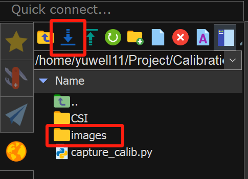
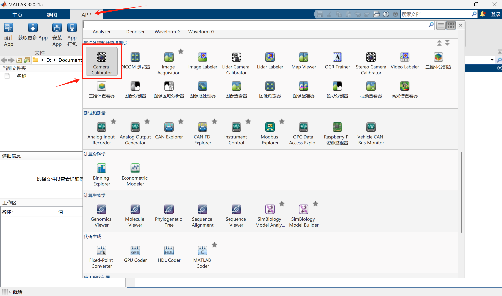
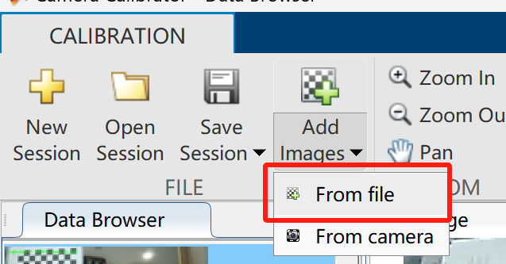

1. Jetson对应目录下创建“Calibration”文件夹
2. 在该目录下打开终端，`nano capture_calib.py` 创建“capture_calib.py”文件
```bash
import cv2
import os
from datetime import datetime

# 创建保存图片的子文件夹
save_dir = "images"
os.makedirs(save_dir, exist_ok=True)

# 打开摄像头（0 是设备索引，如果不行试试 1）
cap = cv2.VideoCapture(0, cv2.CAP_V4L2)
if not cap.isOpened():
    print("无法打开摄像头，请检查设备索引或连接。")
    exit()

# 尝试设置 720p 分辨率
cap.set(cv2.CAP_PROP_FRAME_WIDTH, 1280)
cap.set(cv2.CAP_PROP_FRAME_HEIGHT, 720)

# 获取实际分辨率（验证是否设置成功）
width = int(cap.get(cv2.CAP_PROP_FRAME_WIDTH))
height = int(cap.get(cv2.CAP_PROP_FRAME_HEIGHT))
print(f"摄像头分辨率: {width} x {height}")

print("\n按空格键拍照保存，按 'q' 退出预览")
count = 0

while True:
    ret, frame = cap.read()
    if not ret:
        print("无法获取画面")
        break

    # 显示当前拍摄数量
    cv2.putText(frame, f"Captured: {count}  SPACE: save, Q: quit", (20, 40),
                cv2.FONT_HERSHEY_SIMPLEX, 0.8, (0, 255, 0), 2)
    cv2.imshow("Camera Calibration", frame)

    key = cv2.waitKey(1) & 0xFF
    if key == ord(' '):
        filename = os.path.join(save_dir, f"calib_{count:03d}.jpg")
        cv2.imwrite(filename, frame)
        print(f"已保存 {filename}")
        count += 1
    elif key == ord('q'):
        break

cap.release()
cv2.destroyAllWindows()
```
3. 保存后在终端输入 `python capture_calib.py` 命令行运行.py文件
4. 弹出摄像头显示画面后，手动变换标定板不同位置，按空格键采集图像
5. 完成采集后按“Q”键退出
6. 使用MobaXterm连接Jetson，将采集的图像文件夹“images”下载到Windows本地中
	
7. 打开Matlab中的“Camera Calibrator”进行标定
	
8. 打开Camera Calibrator后添加下载下来的采集图像
	
9. 实际测量标定板方格后填写